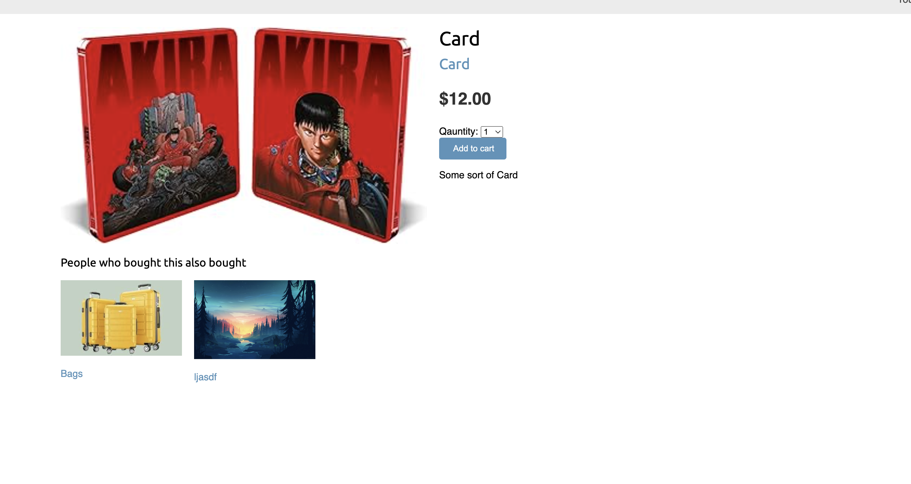

# Ecommerce Project

A fully-featured ecommerce platform with support for coupons, payments, internationalization, async tasks, caching, order exports, and product recommendations.

## Features

- **Apply Coupons**: Users can apply discount coupons at checkout.
- **Stripe Payment Integration**: Secure payment processing with Stripe, including webhook support to send receipts via email.
- **Internationalization (i18n)**:
  - The application supports Spanish, including localized URL patterns.
  - Admins can enter product names and descriptions in Spanish.
- **Asynchronous Tasks**:
  - Emails (e.g., order confirmations and receipts) are sent asynchronously using Celery and RabbitMQ.
- **Export Orders to CSV**: Admins can export order details in CSV format.
- **Product Recommendations**:
  - Uses Redis sorted sets to recommend products frequently bought together.

## Tech Stack

- **Backend**: Django, Celery, RabbitMQ
- **Frontend**: Django Templates, HTML, CSS, JavaScript
- **Database**: Sqlite
- **Caching & Recommendations**: Redis (Sorted Sets for product recommendations)
- **Payment Processing**: Stripe
- **Task Queue**: Celery with RabbitMQ


<p align="center">
  
  
  
</p>

<p align="center">
  
  
</p>

## Installation

1. Clone the repository:

   ```sh
   git clone https://github.com/bikraj2/ecommerce-project.git
   cd ecommerce-project
   ```

2. Install dependencies:

   ```sh
   pip install -r requirements.txt
   ```

3. Set up environment variables and database.

4. Run the application:
   ```sh
   python manage.py runserver
   ```
To start rabbitmq
```sh
docker run -it --rm --name rabbit -p 5672:5672 -p 15672:15672 -d rabbitmq:3  
```
To start redis
```sh
 docker run -it --rm --name my_redis -p 6379:6379 -d redis  
```
To use stripe webhook
```sh
stripe listen --forward-to 127.0.0.1:8000/payment/webhook/  
```
## Configuration

- Update `settings.py` for internationalization and Stripe API keys.
- Configure Celery and RabbitMQ for background tasks.
- Set up Redis for caching and product recommendations.

## License

This project is licensed under the MIT License.
